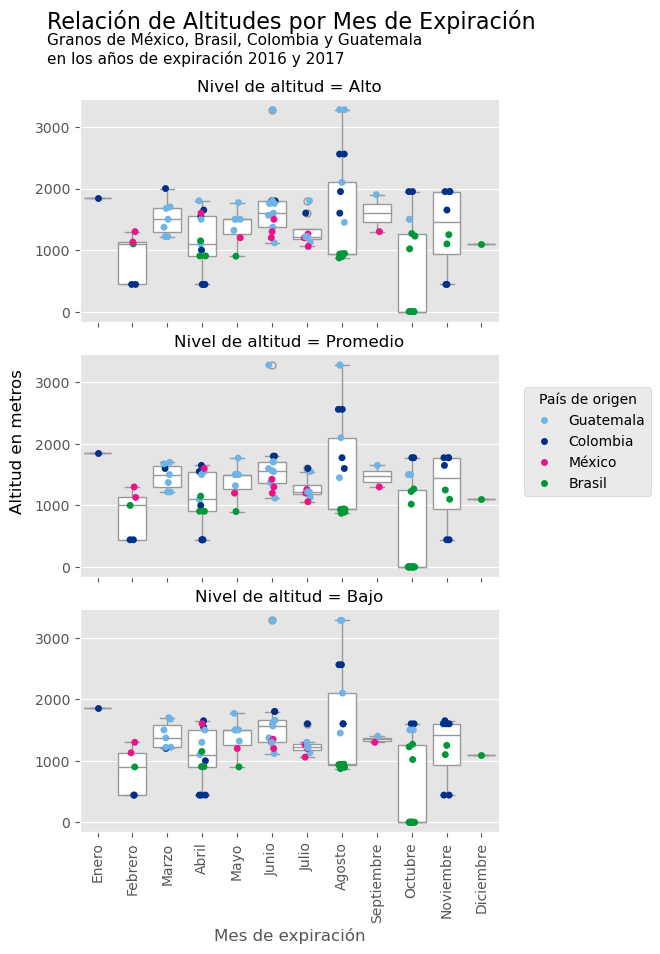
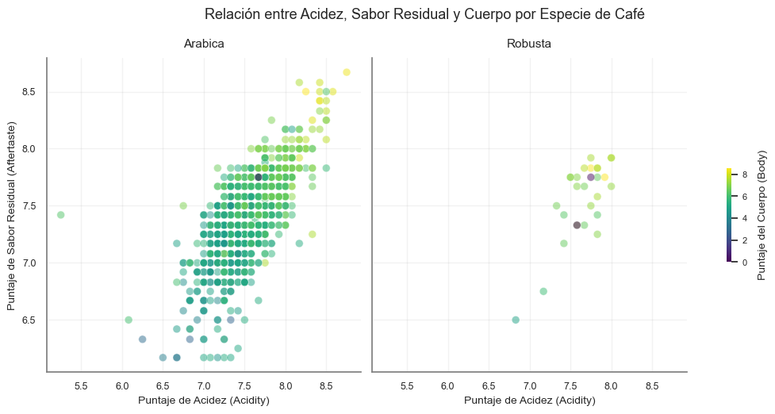

```{r setup, include=FALSE}
knitr::opts_chunk$set(
  results = "hold"
)
```

```{css, echo=FALSE}
/* Agregar nombre de lenguaje de programación a cada chunk */
code.sourceCode.r::before{content:'R'; float:right}
code.sourceCode.python::before{content:'Python'; float:right}
```

# Instrucciones

Se usará el conjunto de datos de encuesta de café (`coffee_ratings.csv`).

-   Actividad 0: Realice un análisis de valores faltantes del objeto `datos`
-   Actividad 1: Crear una columna llamada `color2` que se base en los valores de la columna `color`, que asigne el valor NA si `color == NA`, "#00FF66" si `color == 'Green'`, "#CCEBC5" si `color == 'Bluish-green'` y "#BFFFFF" si `color == 'Blue-green'`
-   Actividad 2: Crear una columna llamada `bag_weight2` que se base en los valores de la columna `bag_weight`, que sólo contenga el valor numérico de ésta. Es decir, `bag_weight2` debe ser numérica. ¿Cuántas observaciones llevaron a ambigüedad para crear esta nueva columna?
-   Actividad 3: Crear dos columnas llamadas `method1` y `method2` que se basen en los valores de la columna `processing_method`, dividiendo en dos partes los valores dicha columna. ¿Cuántas observaciones llevaron a ambigüedad para crear esta nueva columna?
-   Actividad 4: Crear tres columnas llamadas `expiration_day`, `expiration_month` y `expiration_year` que se basen en los valores de la columna `expiration`. ¿Cuántas observaciones llevaron a ambigüedad para crear estas nuevas columnas?
-   Actividad 5: Crear dos columnas llamadas `harvest_mes` y `harvest_anio` que se basen en los valores de la columna `harvest_year`, dividiendo en dos partes los valores dicha columna. ¿Cuántas observaciones llevaron a ambigüedad para crear esta nueva columna?
-   Actividad 6: Elabore una visualización con `ggplot2` que identifique alguna relación entre las columnas `total_cup_points`, `acidity` y `color2` de tal forma que se puedan identificar los colores de la variable `color2`. Es decir, debemos ver los colores, "#00FF66", "#CCEBC5" y "#BFFFFF".
-   Actividad 7: Elabore una visualización de densidad con `ggplot2` de la variable `bag_weight2` diferenciando a los valores de `species`.
-   Actividad 8: Elabore una visualización que relacione el año/mes de expiración con el `total_cup_points` sólo de los granos mexicanos, brasileños, colombianos y guatemaltecos.
-   Actividad 9: Elabore una visualización con `ggplot2` que relacione el mes de expiración con el `altitude_mean_meters`, `altitude_low_meters` y `altitude_high_meters` sólo de los granos mexicanos, brasileños, colombianos y guatemaltecos de los años de expiración 2016 y 2017.
-   Actividad 10: Elabore una visualización con `ggplot2` que relacione el `aftertaste`, `acidity`, `body` y `species` en un mismo canvas.

*Importante:* Sus visualizaciones deben tener formato suficientemente bueno para publicar en alguna revista.

# Librerías y datos

```{r}
#| echo: false
#| include: false
# Cómo ejecutar este chunk, o si es necesario ejecutarlo, dependerá de su instalación de Python
library(reticulate)
# Seleccionamos el environment de python que vamos a utilizar
nombre_env = "diplomadov2"
use_condaenv(nombre_env)

# Environments que no sean de conda:
# use_python(nombre_env)
# use_virtualenv(nombre_env)
repl_python()
```

Cargamos las librerías necesarias de R y Python.

```{r}
library(tidyverse) # Incluye dplyr, ggplot2, stringr y lubridate
library(scales)
library(skimr)
```

```{python}
import pandas as pd
import numpy as np
import matplotlib.pyplot as plt
plt.ioff()
import matplotlib.dates as mdates
from matplotlib.gridspec import GridSpec
import seaborn as sns
from scipy.interpolate import make_interp_spline
plt.ioff()
```

Se usará el conjunto de datos de encuesta de café `coffee_ratings.csv`

```{r}
datos <- read_csv("../datos/coffee_ratings.csv", show_col_types = FALSE)
datos
```

Dimensión del conjunto de datos:

```{r}
dim(datos)
```

También los cargamos en python:

```{python}
datos = pd.read_csv("../datos/coffee_ratings.csv")
```

Preferimos imprimir dataframes de pandas grandes desde R para una mejor visualización. Observe la diferencia:

```{python}
# pandas DataFrame
datos.head()
```

```{r}
# Accedemos a objetos de python con la siguiente sintaxis
py$datos |> head()
```


```{python}
datos.shape
```

# Actividad 0

Realice un análisis de valores faltantes del objeto `datos`

Resumen de valores faltantes en R

```{r}
resumen <- skim(datos) %>%
  as_tibble()

resumen <- resumen %>%
  mutate(missing_rate = 1 - complete_rate)

resumen %>%
  select(skim_variable, skim_type, n_missing, missing_rate) %>%
  arrange(desc(missing_rate))
```

Visualización de valores faltantes.

```{r}
#| fig-height: 8
resumen %>%
  select(skim_variable, missing_rate) %>%
  arrange(desc(missing_rate)) %>%
  ggplot(aes(x = reorder(skim_variable, missing_rate), y = missing_rate)) +
  geom_col(fill = "orange") +
  coord_flip() +
  labs(
    x = "variable", 
    y = "% de faltantes", 
    title = "Valores faltantes por variable"
  )
```

**Resumen de valores faltantes en Python**

```{python}
resumen = pd.DataFrame({
    "variable": datos.columns,
    "n_missing": datos.isna().sum().values,
    "missing_rate": datos.isna().mean().values
})

# Ordenar de mayor a menor porcentaje faltante
resumen = resumen.sort_values(
    by = "missing_rate",
    ascending = False
)

resumen["variable"] = resumen["variable"].astype(str)
resumen["missing_rate"] = pd.to_numeric(
    resumen["missing_rate"]
)
```

```{r}
py$resumen
```


```{python}
#| fig-height: 8
sns.barplot(
    data=resumen,
    x="missing_rate",
    y="variable",
    color="hotpink"
)

plt.title("Valores faltantes por variable")
plt.xlabel("% de faltantes")
plt.ylabel("Variable")

plt.tight_layout()
plt.show()
plt.close()
```

Observamos que `lot_number`  (número de lote del café evaluado) es la variable que presenta la mayor proporción de valores faltantes (79%), seguida por `farm_name` (26%) y `mill` (molino donde se procesó el café, 23%), lo que sugiere que no todas las fincas o productores documentan con el mismo nivel de detalle la información de sus lotes y procesos de molienda.

Por otra parte, identificamos un patrón de ausencia conjunta en las variables geográficas relacionadas con la altitud, pues los registros con valores faltantes en `altitude_low_meters`, también presentan datos faltantes en `altitude_high_meters` y `altitude_mean_meters`. De manera similar, los registros con valores faltantes en `altitude`, tienden también a presentar valores ausentes en la variable `variety`. Lo que indica que esos faltantes no son aleatorios, sino sistemáticos.

No obstante, las variables de evaluación sensorial (`aroma`, `acidity`, `body`, `balance`, `flavor`, `aftertaste`, `cupper_points`, `sweetness`, `uniformity`, `clean_cup`) y las de clasificación (`total_cup_points`, `species`) están prácticamente completas para efectos posteriores de análisis.

# Actividad 1

Crear una columna llamada `color2` que se base en los valores de la columna `color`, que asigne el valor NA si  `color == NA`, `"#00FF66"` si `color == 'Green'`, `"#CCEBC5"` si `color == 'Bluish-green'` y `"#BFFFFF"` si `color == 'Blue-green'`

**R**

Crear columna `color2`:

```{r}
datos$color2 <- dplyr::case_when(
  is.na(datos$color) ~ NA_character_,
  datos$color == "Green" ~ "#00FF66",
  datos$color == "Bluish-Green" ~ "#CCEBC5",
  datos$color == "Blue-Green" ~ "#BFFFFF",
  TRUE ~ NA_character_
)
```

Visualización de la nueva columna

```{r}
datos %>% distinct(color, color2)
```

**Python**

```{python}
datos['color2'] = np.select(
    [
        datos['color'].isna(),
        datos['color'] == "Green",
        datos['color'] == "Bluish-Green",
        datos['color'] == "Blue-Green"
    ],
    [
        None,
        "#00FF66",
        "#CCEBC5",
        "#BFFFFF"
    ],
    default = None
)

sub_datos = datos[['color', 'color2']].drop_duplicates()
print(sub_datos)
```

# Actividad 2

Crear una columna llamada `bag_weight2` que se base en los valores de la columna `bag_weight`, que sólo contenga el valor numérico de ésta. Es decir, `bag_weight2` debe ser numérica. ¿Cuántas observaciones llevaron a ambigüedad para crear esta nueva columna?

Obteniendo los valores únicos de la columna `bag_weight`, se identificaron varias ambigüedades que se pueden clasificar o agrupar en 4 casos:
- Caso (kg, lbs): Las observaciones contienen unidades mixtas (kg seguido de lbs).
- Caso (lbs): Las observaciones están registradas en lbs.
- Caso (kg): Las observaciones están registradas en kg.
- Caso (#): Las observaciones no muestran ningún tipo de medida, únicamente el valor numérico.

Para estandarizar la misma unidad de medida, se decidió trabajar con kg, entonces las observaciones en lbs se multiplicaron por el factor de conversión a kg (1lb = 0.453592 kg), los demás casos permanecieron sin cambios, únicamente se extrajo su valor numérico. De esta forma se evitan mayores ambigüedades.

**R**

```{r}
datos <- datos %>%
  mutate(
    bag_weight2 = case_when(
      #Si tenemos kg (aunque también diga lbs), tomamos los kg
      str_detect(bag_weight, "kg") ~ parse_number(bag_weight),
      #Si sólo tenemos lbs, convertimos a kg
      str_detect(bag_weight, "lbs") ~ parse_number(bag_weight) * 0.453592,
      #Si sólo es número, mantenemos las unidades
      TRUE ~ parse_number(bag_weight)
    )
  )
```

```{r}
datos %>% distinct(bag_weight,bag_weight2)
```

**Python**

```{python}
num = datos["bag_weight"].str.extract(r"(\d+\.?\d*)")[0].astype(float)  # regex d/p/d

datos["bag_weight2"] = np.where(
    datos["bag_weight"].str.contains("lbs") & 
    ~datos["bag_weight"].str.contains("kg"),
    num * 0.453592,
    num,
)
```

```{python}
bagweight = datos[['bag_weight', 'bag_weight2']].drop_duplicates()
```

```{r}
py$bagweight
```

# Actividad 3

Crear dos columnas llamadas `method1` y `method2` que se basen en los valores de la columna `processing_method`, dividiendo en dos partes los valores dicha columna. ¿Cuántas observaciones llevaron a ambigüedad para crear esta nueva columna?

**R**

Crear columnas `method1` y `method2`:

```{r}
datos <- datos %>%
  mutate(
    # str_split_fixed() devuelve una matriz, por eso usamos [,1] y [,2]
    method1 = str_split_fixed(processing_method, "/", n = 2)[, 1] %>% str_trim(),
    method2 = str_split_fixed(processing_method, "/", n = 2)[, 2] %>% str_trim(),
    # Convertir strings vacíos a NA
    method1 = na_if(method1, ""),
    method2 = na_if(method2, "")
  )
```

Observaciones ambiguas:

1. `NA`s originales en `processing_method`.
2. Valores sin `"/"` (no se pueden dividir en dos partes, e.g. `"Other"`).

```{r}
na_originales  <- sum(is.na(datos$processing_method))
sin_slash      <- sum(!is.na(datos$processing_method) &
                        !str_detect(datos$processing_method, "/"))
ambiguedad_act3 <- na_originales + sin_slash

cat(sprintf("NAs originales en processing_method : %d\n", na_originales))
cat(sprintf("Registros sin '/'                   : %d\n", sin_slash))
cat(sprintf("Total observaciones ambiguas        : %d\n", ambiguedad_act3))
cat("\nValores únicos resultantes:\n")
datos %>%
  distinct(processing_method, method1, method2) %>%
  print()
```

**Python**

```{python}
#| results: hold
# Dividir por '/' en máximo 2 partes
split_cols = datos["processing_method"].str.split("/", n=1, expand=True)
datos["method1"] = split_cols[0].str.strip()
datos["method2"] = split_cols[1].str.strip() if 1 in split_cols.columns else np.nan

# Convertir strings vacíos a NaN
datos["method1"] = datos["method1"].replace("", np.nan)
datos["method2"] = datos["method2"].replace("", np.nan)

# Observaciones ambiguas:
# 1. NAs originales -> no hay información para dividir
# 2. Sin '/' -> sólo tiene una parte (e.g. "Other")
na_originales = datos["processing_method"].isna().sum()
sin_slash = (~datos["processing_method"].isna()) & (
    ~datos["processing_method"].str.contains("/", na=False)
)
ambiguedad_act3 = na_originales + sin_slash.sum()

print(f"NAs originales en processing_method : {na_originales}")
print(f"Registros sin '/'                   : {sin_slash.sum()}")
print(f"Total observaciones ambiguas        : {ambiguedad_act3}")
print()
print("Valores únicos resultantes:")
print(
    datos[["processing_method", "method1", "method2"]]
    .drop_duplicates()
    .to_string(index=False)
)
```

# Actividad 4

Crear tres columnas llamadas `expiration_day`, `expiration_month` y `expiration_year` que se basen en los valores de la columna `expiration`. ¿Cuántas observaciones llevaron a ambigüedad para crear estas nuevas columnas?

**R**

Primero revisemos si hay algún valor faltante:

```{r}
anyNA(datos$expiration)
```

Vamos a utilizar la función `mdy()` (por *month day year*, pues las fechas están en formato Mes Día, Año) del paquete `lubridate` para convertir la columna `expiration` a tipo fecha.

A pesar de que la función `mdy()` puede reconocer muchos formatos diferentes en los que una fecha puede estar escrito, primero hagamos unas validaciones rápidas para asegurarnos de que ninguna fecha será convertida incorrectamente.

Revisemos que la primera sección de cada *string*, antes del primer número, es el mes:

```{r}
unique(sub("^([^0-9]+).*", "\\1", datos$expiration))
```

En efecto, la primera parte de cada string es el nombre del mes. Ahora veamos si la última parte de cada *string* corresponde a un año:

```{r}
unique(str_sub(datos$expiration, -5, -1))
```

Lo único raro es el valor que termina en el carácter de nueva línea (`"\n"`). Sin embargo, la función `mdy()` no tiene problemas en convertir una fecha que termine con ese carácter. Además, solo una fila tiene esta inconsistencia:

```{r}
datos |>
  filter(grepl("\\n$", expiration)) |>
  select(expiration)
```

```{r}
mdy("November 15th, 2018\n")
class(mdy("November 15th, 2018\n"))
```

Extraigamos la sección de cada string que esté rodeadas de espacios, lo cual correspondería al día, su sufijo ordinal y una coma:

```{r}
datos$expiration |>
  str_extract("(?<=\\s).+?(?=[\\s])") |>
  unique() |>
  sort()
```

Todos los valores son consistentes. Vamos a realizar una última validación para determinar si todas las strings tienen el mismo formato:

1. Conjunto de caracteres correspondientes al mes. Ya sabemos que todos los meses están nombrados consistentemente.
2. Un espacio.
3. Un número más su sufijo ordinal y una coma.
4. Un espacio.
5. 4 dígitos, correspondientes al año. Ya vimos que todos los años están nombrados consistentemente.

Como ya vimos, una de las filas no cumple con este formato, ya que termina con el carácter de nueva línea, pero la función `mdy()` no tiene problemas para convertir correctamente esta *string* a tipo fecha.

```{r}
datos |>
  filter(!grepl("^([A-Za-z]+) ([0-9]+(?:st|nd|rd|th)), ([0-9]{4})$", expiration)) |>
  select(expiration)
```

Ahora sí convirtamos la columna `expiration` a tipo fecha con la función `mdy()`. Podemos extraer el día, mes y año con las funciones `day()`, `month()` y `year()` respectivamente. Echemos un vistazo al resultado y después actualicemos el dataframe.

```{r}
datos |>
  mutate(
    expiration_date_type = mdy(expiration),
    expiration_day = day(expiration_date_type),
    expiration_month = month(expiration_date_type),
    expiration_year = year(expiration_date_type)
  ) |>
  select(expiration, expiration_date_type, expiration_day, expiration_month, expiration_year) |>
  head(10)
```

```{r}
datos <- datos |>
  mutate(
    expiration_date_type = mdy(expiration),
    expiration_day = day(expiration_date_type),
    expiration_month = month(expiration_date_type),
    expiration_year = year(expiration_date_type)
  ) |>
  # Quitamos la columna intermedia que utilizamos para crear las de interés
  select(-expiration_date_type)
```

No hubo ninguna ambigüedad:

```{r}
anyNA(datos$expiration_day)
anyNA(datos$expiration_month)
anyNA(datos$expiration_year)
```

```{r}
range(datos$expiration_day)
range(datos$expiration_month)
range(datos$expiration_year)
```

**Python**

Ya vimos en la parte de R que todas las observaciones de esta columna siguen el mismo patrón, por lo que podemos usar expresiones regulares para obtener cada componente de la fecha.

```{python}
# Crear nuevas columnas llamadas expiration_day, expiration_month y expiration_year
datos["expiration_day"] = datos["expiration"].str.extract(r"\s(\d+).*").astype(int)
datos["expiration_month"] = datos["expiration"].str.extract(r"(\w+).*")
datos["expiration_year"] = datos["expiration"].str.extract(r"\s(\d{4}).*").astype(int)

# Vistazo al resultado
datos[["expiration", "expiration_day", "expiration_month", "expiration_year"]].head(7)
```

# Actividad 5

Crear dos columnas llamadas `harvest_mes` y `harvest_anio` que se basen en los valores de la columna `harvest_year`, dividiendo en dos partes los valores dicha columna. ¿Cuántas observaciones llevaron a ambigüedad para crear esta nueva columna?

**R**

Primero revisemos si hay valores faltantes en la columna `harvest_year`

```{r}
# ¿Cuantos valores faltantes contiene?
sum(is.na(datos$harvest_year))
```

Vemos que tiene 47 valores faltantes.

Ahora, ¿qué tipo de valores contiene la columna `harvest_year`?

```{r}
# ¿qué tipo de valores contiene?
unique(datos$harvest_year)
```

Notamos que es una columna que registra fechas pero tiene serios problemas de calidad de datos. Es inconsistente en el formato de las fechas; mezcla texto en español e inglés; contiene datos de prueba como `"mmm"` y `"TEST"`; tiene errores tipográficos evidentes; contiene rangos de fechas; mezcla fechas en años, meses, estaciones del año, trimestres, etc.

A continuación, vamos extraer, cuando sea posible, el año y el mes de la columna `harvest_year` mediante expresiones regulares.

La nueva columna `harvest_anio` captura el primer año que aparece en la observación, mientras que `harvest_mes` captura el primer mes que aparece en la observación.

```{r}
# Definir el patrón de meses en inglés y español
patron_meses <- "(Jan|Ene|Feb|Mar|Apr|Abr|May|Jun|Jul|Aug|Ago|Sep|Oct|Nov|Dec|Dic)"

# Crear columnas harvest_anio y harvest_mes a partir de harvest_year
datos <- datos %>%
  mutate(
    harvest_anio = case_when(
      # Busca el primer grupo de 4 dígitos seguidos
      str_detect(harvest_year, "\\b\\d{4}\\b") ~ str_extract(harvest_year, "\\b\\d{4}\\b"),
      # Busca casos especiales
      str_detect(harvest_year, "4T/10|72010") ~ "2010",
      str_detect(harvest_year, "08/09") ~ "2008",
      TRUE ~ NA_character_
    ) %>% as.numeric(),
    
    # Extrae la primera palabra que parezca un mes
    mes_corto = str_extract(harvest_year, regex(patron_meses, ignore_case = TRUE)),
    
    harvest_mes = case_when(
      # Convierte el mes corto a mes completo en inglés
      str_detect(mes_corto, regex("Jan|Ene", ignore_case = T)) ~ "January",
      str_detect(mes_corto, regex("Feb", ignore_case = T)) ~ "February",
      str_detect(mes_corto, regex("Mar", ignore_case = T)) ~ "March",
      str_detect(mes_corto, regex("Apr|Abr", ignore_case = T)) ~ "April",
      str_detect(mes_corto, regex("May", ignore_case = T)) ~ "May",
      str_detect(mes_corto, regex("Jun", ignore_case = T)) ~ "June",
      str_detect(mes_corto, regex("Jul", ignore_case = T)) ~ "July",
      str_detect(mes_corto, regex("Aug|Ago", ignore_case = T)) ~ "August",
      str_detect(mes_corto, regex("Sep", ignore_case = T)) ~ "September",
      str_detect(mes_corto, regex("Oct", ignore_case = T)) ~ "October",
      str_detect(mes_corto, regex("Nov", ignore_case = T)) ~ "November",
      str_detect(mes_corto, regex("Dec|Dic", ignore_case = T)) ~ "December",
      TRUE ~ NA_character_
    )
  ) %>% 
  select(-mes_corto) # Elimina la variable temporal
```

Visualización de las nuevas columnas:

```{r}
datos %>% distinct(harvest_year, harvest_anio, harvest_mes)
```

¿Cuántas observaciones llevaron a ambigüedad para crear estas nuevas columnas?

Para la columna `harvest_year` consideramos que las observaciones que llevaron a ambigüedad en las columnas `harvest_anio` y `harvest_mes` son:

+ valores faltantes
+ observaciones que no contienen año
+ observaciones que no contienen mes
+ observaciones que contienen estaciones y trimestres
+ observaciones que no son fechas
+ observaciones que provienen de rangos de fechas

```{r}
# Identificar ambigüedades
ambiguos_act5_R <- datos %>%
  dplyr::filter(
    is.na(harvest_year) |
      is.na(harvest_anio) |
      is.na(harvest_mes) |
      str_detect(harvest_year, "\\d[Tt]") |
      str_detect(harvest_year, regex("spring|fall|winter|summer", ignore_case = TRUE)) |
      str_detect(harvest_year, "mmm|TEST") |
      str_detect(harvest_year, "-|/| to | a |Through")
  )

# Contar ambigüedades
total_ambiguos_act5_R <- nrow(ambiguos_act5_R)
print(paste(
  "Número de observaciones que generan ambigüedad:",
  total_ambiguos_act5_R
))
```

En conclusión, hay 1,333 observaciones en la columna `harvest_year` que generan ambigüedad en la columnas `harvest_anio` y `harvest_mes`. Prácticamente todas.

**Python**

Primero revisemos si hay valores faltantes en la columna `harvest_year` y cuántos:

```{python}
print(datos["harvest_year"].isna().sum())
```

Vemos que tiene 47 valores faltantes.

Ahora, ¿qué tipo de valores contiene la columna `harvest_year`?

```{python}
#| results: hold
print(datos["harvest_year"].unique())
print("tipos:", len(datos["harvest_year"].unique()))
```

Notamos que es una columna que registra fechas pero tiene serios problemas de calidad de datos. Es inconsistente en el formato de las fechas; mezcla texto en español e inglés; contiene datos de prueba como "mmm" y "TEST"; tiene errores tipográficos evidentes; contiene rangos de fechas; mezcla fechas en años, meses, estaciones del año, trimestres, etc.

A continuación, vamos extraer, cuando sea posible, el año y el mes de la columna `harvest_year` mediante expresiones regulares.

La nueva columna `harvest_anio` captura el primer año que aparece en la observación, mientras que `harvest_mes` captura el primer mes que aparece en la observación.

```{python}
# Definir el patrón de meses en inglés y español
patron_meses = r"(Jan|Ene|Feb|Mar|Apr|Abr|May|Jun|Jul|Aug|Ago|Sep|Oct|Nov|Dec|Dic)"

# Diccionario para mapear el mes corto extraído al mes completo en inglés
mapa_meses = {
    "Jan": "January",
    "Ene": "January",
    "Feb": "February",
    "Mar": "March",
    "Apr": "April",
    "Abr": "April",
    "May": "May",
    "Jun": "June",
    "Jul": "July",
    "Aug": "August",
    "Ago": "August",
    "Sep": "September",
    "Oct": "October",
    "Nov": "November",
    "Dec": "December",
    "Dic": "December",
}

# Crear nuevas columnas harvest_mes y harvest_anio a partir de harvest_year

# Extraer el año (primer grupo de 4 dígitos que detecte)
datos["harvest_anio"] = datos["harvest_year"].str.extract(r"\b(\d{4})\b")[0]

# Determinar condiciones para casos específicos del año
condiciones_anio = [
    datos["harvest_year"].str.contains("4T/10|72010", na=False),
    datos["harvest_year"].str.contains("08/09", na=False),
]
# Determinar valores para casos específicos del año
valores_anio = ["2010", "2008"]

# Asigna valores a casos específicos del año
datos["harvest_anio"] = np.select(condiciones_anio, valores_anio, default=datos["harvest_anio"])

# Extraer el mes corto (ignorando mayúsculas/minúsculas)
mes_corto = datos["harvest_year"].str.extract(f"(?i){patron_meses}", expand=False)

# Capitalizar la primera letra para que coincida exactamente con las llaves del diccionario mapa_meses
mes_corto_cap = mes_corto.str.capitalize()

# Convertir el mes corto a mes completo usando el diccionario (los no encontrados quedan como NaN)
datos["harvest_mes"] = mes_corto_cap.map(mapa_meses).astype("object")
```

Resultado de lo hecho en Python:

```{python}
harvest_python = datos[["harvest_year", "harvest_anio", "harvest_mes"]].drop_duplicates()
```

```{r}
py$harvest_python
```

**¿Cuántas observaciones llevaron a ambigüedad para crear estas nuevas columnas?**

Para la columna `harvest_year` consideramos que las observaciones que llevaron a ambigüedad en las columnas `harvest_anio` y `harvest_mes` son:
+ valores faltantes
+ observaciones que no contienen año
+ observaciones que no contienen mes
+ observaciones que contienen estaciones y trimestres
+ observaciones que no son fechas
+ observaciones que provienen de rangos de fechas

```{python}
#| results: hold
# Identificar ambigüedades
ambiguos_act5_Py = datos[
    datos["harvest_year"].isna()
    | datos["harvest_anio"].isna()
    | datos["harvest_mes"].isna()
    | datos["harvest_year"].str.contains(r"\d[Tt]", na=False)
    | datos["harvest_year"].str.contains(r"spring|fall|winter|summer", case=False, na=False)
    | datos["harvest_year"].str.contains(r"mmm|TEST", case=False, na=False)
    | datos["harvest_year"].str.contains(r"-|/| to | a |Through", na=False)
]

# Contar ambigüedades
total_ambiguos_act5_Py = len(ambiguos_act5_Py)
print(f"Número de observaciones que generan ambigüedad: {total_ambiguos_act5_Py}")
```

En conclusión, hay 1,333 observaciones en la columna `harvest_year` que generan ambigüedad en la columnas `harvest_anio` y `harvest_mes`. Prácticamente todas.

# Actividad 6

Elabore una visualización con `ggplot2` que identifique alguna relación entre las columnas total_cup_points, acidity y color2 de tal forma que se puedan identificar los colores de la variable color2. Es decir, debemos ver los colores, "#00FF66", "#CCEBC5" y "#BFFFFF".

**R**

```{r}
datos %>%
  dplyr::filter(!is.na(color2) & acidity != 0 & total_cup_points != 0) %>%
  ggplot(aes(x = acidity,
           y = total_cup_points,
           color = color2)) +

  geom_point(size = 1.5, alpha = 2) +

  scale_color_identity(
    guide = "legend",
    labels = c("Green", "Bluish-green", "Blue-green"),
    breaks = c("#00FF66", "#CCEBC5", "#BFFFFF"),
    name = "Color"
  ) +

  labs(
    title = "Relación entre Acidity y Total Cup Points",
    x = "Acidity",
    y = "Total Cup Points"
  ) +

  theme_minimal()
```

Notemos que a media que incremente el puntaje de acidez, también tiende a incrementar el puntaje total del café, lo que parece indicar una relación lineal y positiva entre las variables observadas.

```{r}
cor(datos$total_cup_points, datos$acidity)
```

Con la correlación de Pearson de $r=0.797$ que confirmamos la relación es relativamente fuerte y positiva entre `acidity` y `total_cup_points`, de modo que, en general, los cafés con mayores calificaciones de acidez, tienden también a obtener puntajes totales más altos.

No obstante, respecto a la variable `color2`, se observa un claro predominio de la categoría Green, mientras que Bluish-green y Blue-green aparecen con mucha menor frecuencia, por lo que no se aprecia una diferenciación visual fuerte entre colores en la relación analizada.

**Python**

```{python}
import matplotlib.patches as mpatches

# Preparación de datos
datos2 = datos[
    (datos["total_cup_points"] > 0) & (datos["acidity"] > 0) & (~datos["color2"].isna())
][["total_cup_points", "acidity", "color2"]]

plt.figure(figsize=(8,6))
plt.scatter(
    datos2['acidity'],
    datos2['total_cup_points'],
    c=datos2['color2'],
    s=20,
    alpha=0.7
)
plt.title("Relación entre Acidity y Total Cup Points")
plt.xlabel("Acidity")
plt.ylabel("Total Cup Points")

legend_elements = [
    mpatches.Patch(color="#00FF66", label="Green"),
    mpatches.Patch(color="#CCEBC5", label="Bluish-green"),
    mpatches.Patch(color="#BFFFFF", label="Blue-green")
]

plt.legend(handles=legend_elements, title="Color")

plt.grid(False)
plt.tight_layout()

plt.show()
```

```{python}
datos[['total_cup_points', 'acidity']].corr()
```

# Actividad 7

Elabore una visualización de densidad con `ggplot2` de la variable `bag_weight2` diferenciando a los valores de `species`.

**R**

A partir del resumen descriptivo `summary(datos$bagweight2)`, observamos una distribución asimétrica con valores extremadamente grandes. El 75% de los datos es menor o igual a 69 kg, mientras que hay valores por encima de los 1000 kg, generando una diferencia en la escala de los datos.

Es por ello que se decidió utilizar una escala logarítmica en el eje `x`, esto permitió reducir este efecto de valores extremos y mejorar la visibilización del gráfico. Dado que `log(0)` es indefinido, las observaciones con valor igual a 0 (4 observaciones) no fueron consideradas dentro de la transformación logarítmica, para fines prácticos.

Con esto, podemos observar dos principales concentraciones de pesos de bolsa: entre 1 a 4 kg, y otra entre 50 a 100 kg. Siendo la especie *Arabica* aquella con menor dispersión, es decir pesos más estandarizados mientras que la especie *Robusta*, tiene pesos con mayor variación.

```{r}
# Resumen adicional
summary(datos$bag_weight2)
```

Gráfico de densidad en escala logarítmica:

```{r}
datos |>
  filter(bag_weight2 > 0) |>
  ggplot(aes(x = bag_weight2, fill = species)) +
  geom_density(alpha = 0.5) +
  scale_x_log10(limits = c(1, 20000)) +
  labs(
    title = "Distribución de bag_weight2 por especie de café", 
    x = "Peso de bolsa (kg, escala log10)", 
    y = "Densidad"
  ) +
  theme_minimal(base_size = 13) +
  theme(plot.title = element_text(
    hjust = 0.5,
    # Mitad del título
    face = "bold",
    size = 16
  ))
```

**Python**

```{python}
datos_plot = datos[datos["bag_weight2"] > 0] # Indefinido log(0)
sns.kdeplot(
    data=datos_plot,
    x=np.log10(datos_plot["bag_weight2"]),  # Escala log
    hue="species",
    fill=True,
    alpha=0.5,
    common_norm=False
)
plt.xlabel("bag_weight2 (log10)")
plt.ylabel("Densidad")
plt.title("Distribución de bag_weight2 por especie de café")
plt.show()
plt.close()
```

# Actividad 8

Elabore una visualización que relacione el año/mes de expiración con el `total_cup_points` sólo de los granos mexicanos, brasileños, colombianos y guatemaltecos.

**R**

```{r}
paises <- c("Mexico", "Brazil", "Colombia", "Guatemala")
colores <- c(
  "Mexico"    = "#FF6B35",
  "Brazil"    = "#06D6A0",
  "Colombia"  = "#118AB2",
  "Guatemala" = "#FFD166"
)

datos_act8 <- datos %>%
  mutate(
    expiration_parsed = mdy(str_replace(expiration, "(\\d+)(st|nd|rd|th)", "\\1")),
    exp_ym            = floor_date(expiration_parsed, "month")
  ) %>%
  filter(country_of_origin %in% paises,
         !is.na(exp_ym),
         !is.na(total_cup_points))

# Media global como referencia
media_global <- mean(datos_act8$total_cup_points, na.rm = TRUE)
```

```{r}
p8 <- ggplot(
  datos_act8,
  aes(
    x = exp_ym,
    y = total_cup_points,
    color = country_of_origin,
    fill  = country_of_origin
  )
) +
  
  geom_point(alpha = 0.25,
             size = 1.5,
             shape = 16) +
  
  geom_smooth(
    method = "loess",
    se = TRUE,
    alpha = 0.12,
    linewidth = 1.8
  ) +

  scale_color_manual(values = colores) +
  scale_fill_manual(values  = colores) +

  scale_x_date(
    date_breaks = "2 years",
    date_labels = "%Y",
    expand      = expansion(mult = 0.03)
  ) +
  scale_y_continuous(
    limits = c(62, 95),
    breaks = seq(65, 95, by = 5)
  ) +

  facet_wrap(~ country_of_origin, ncol = 2) +

  labs(
    title    = "Puntaje Total de Taza según Fecha de Expiración",
    x        = "Año de expiración",
    y        = "Total Cup Points"
  ) +

  theme_minimal(base_size = 12) +
  theme(
    plot.background  = element_rect(fill = "white", color = NA),
    panel.background = element_rect(fill = "white", color = NA),

    panel.grid.major.y = element_line(color = "#F0F0F0", linewidth = 0.7),
    panel.grid.major.x = element_blank(),
    panel.grid.minor   = element_blank(),

    panel.border = element_blank(),
    axis.line.x  = element_line(color = "#DDDDDD"),
    axis.line.y  = element_line(color = "#DDDDDD"),

    plot.title    = element_text(face  = "bold", size = 15,
                                 color = "#111111", margin = margin(b = 4)),
    plot.subtitle = element_text(size  = 10.5, color = "#777777",
                                 face  = "italic", margin = margin(b = 12)),
    plot.caption  = element_text(size  = 7.5, color = "#BBBBBB",
                                 margin = margin(t = 10)),
    plot.margin   = margin(20, 20, 12, 20),

    axis.title   = element_text(size = 9, color = "#555555"),
    axis.text.x  = element_text(angle = 45, hjust = 1,
                                size = 8.5, color = "#555555"),
    axis.text.y  = element_text(size = 8.5, color = "#555555"),

    strip.text       = element_text(face = "bold", size = 11,
                                    color = "white", 
                                    margin = margin(4, 4, 4, 4)),
    strip.background = element_rect(fill = "#333333", color = NA),

    legend.position = "none"
  )

p8
```

```{r}
cat(sprintf("Registros graficados: %d\n", nrow(datos_act8)))
cat("\nConteo por país:\n")
print(table(datos_act8$country_of_origin))
```

**Python**

```{python}
datos["expiration_parsed"] = pd.to_datetime(
    datos["expiration"].str.replace(r"(\d+)(st|nd|rd|th)", r"\1", regex=True),
    errors="coerce",
)

datos["exp_ym"] = datos["expiration_parsed"].dt.to_period("M").dt.to_timestamp()

paises = ["Mexico", "Brazil", "Colombia", "Guatemala"]
colores = {
    "Mexico": "#FF6B35",
    "Brazil": "#06D6A0",
    "Colombia": "#118AB2",
    "Guatemala": "#FFD166",
}

d = (
    datos[datos["country_of_origin"].isin(paises)]
    .dropna(subset=["exp_ym", "total_cup_points"])
    .copy()
)

fig = plt.figure(figsize=(16, 9), facecolor="white")
fig.suptitle(
    "Puntaje Total de Taza según Fecha de Expiración",
    fontsize=17,
    fontweight="bold",
    color="#111111",
    y=0.98,
)


gs = GridSpec(
    2,
    2,
    figure=fig,
    hspace=0.50,
    wspace=0.28,
    left=0.07,
    right=0.97,
    top=0.92,
    bottom=0.10,
)

for idx, pais in enumerate(paises):
    ax = fig.add_subplot(gs[idx // 2, idx % 2])
    sub = d[d["country_of_origin"] == pais].sort_values("exp_ym")
    color = colores[pais]

    ax.scatter(
        sub["exp_ym"],
        sub["total_cup_points"],
        color=color,
        alpha=0.30,
        s=20,
        zorder=3,
        linewidths=0,
    )

    monthly = sub.groupby("exp_ym")["total_cup_points"].median().reset_index()
    if len(monthly) > 3:
        x_num = mdates.date2num(monthly["exp_ym"])
        k = min(3, len(monthly) - 1)
        spl = make_interp_spline(x_num, monthly["total_cup_points"], k=k)
        x_new = np.linspace(x_num.min(), x_num.max(), 300)
        ax.plot(
            mdates.num2date(x_new), spl(x_new), color=color, linewidth=2.2, zorder=4
        )

    ax.fill_between(mdates.num2date(x_new), spl(x_new), alpha=0.08, color=color)

    ax.set_facecolor("white")
    ax.spines[["top", "right"]].set_visible(False)
    ax.spines["left"].set_color("#DDDDDD")
    ax.spines["bottom"].set_color("#DDDDDD")
    ax.grid(axis="y", color="#F0F0F0", linewidth=0.7)
    ax.grid(axis="x", visible=False)
    ax.tick_params(colors="#555555", labelsize=8.5)
    ax.xaxis.set_major_formatter(mdates.DateFormatter("%Y"))
    ax.xaxis.set_major_locator(mdates.YearLocator(2))
    plt.setp(ax.xaxis.get_majorticklabels(), rotation=45, ha="right")
    ax.set_ylim(62, 95)
    ax.set_yticks(range(65, 96, 5))

    ax.set_title(
        f"  {pais}",
        fontsize=12,
        fontweight="bold",
        color="white",
        pad=0,
        loc="left",
        bbox=dict(boxstyle="square,pad=0.4", facecolor=color, edgecolor="none"),
    )
    ax.set_ylabel("Total Cup Points", fontsize=9, color="#555555")
    ax.set_xlabel("Año de expiración", fontsize=9, color="#555555")

    ax.text(
        0.98,
        0.05,
        f"n = {len(sub)}",
        transform=ax.transAxes,
        ha="right",
        va="bottom",
        fontsize=8,
        color="#AAAAAA",
    )

plt.show()
plt.close()
```


# Actividad 9

Elabore una visualización con `ggplot2` que relacione el mes de expiración con el `altitude_mean_meters`, `altitude_low_meters` y `altitude_high_meters` sólo de los granos mexicanos, brasileños, colombianos y guatemaltecos de los años de expiración 2016 y 2017.

**R**

Vamos a crear un dataframe que utilizaremos para crear la gráfica llamado `datos_altitud`.

```{r}
datos_altitud <- datos |>
  select(expiration_year, expiration_month, country_of_origin,
         altitude_mean_meters, altitude_low_meters, altitude_high_meters) |>
  filter(
    country_of_origin %in% c("Mexico", "Brazil", "Colombia", "Guatemala"),
    expiration_year %in% c(2016, 2017)
  ) |>
  drop_na() |>
  pivot_longer(
    cols = starts_with("altitude"),
    names_to = "altitude",
    values_to = "meters"
  ) |>
  mutate(
    altitude = str_extract(altitude, "(?<=_)[a-z]+(?=_)"), # Quitar 'altitude_' y '_meters'
    altitude = case_when(
      altitude == "low" ~ "Bajo",
      altitude == "mean" ~ "Promedio",
      altitude == "high" ~ "Alto"
    ),
    altitude = factor(altitude, levels = c("Alto", "Promedio", "Bajo"), ordered = TRUE),
    expiration_month = month(expiration_month, label = TRUE, abbr = FALSE),
   expiration_month = factor(
     str_to_title(expiration_month),
     levels = c("Enero", "Febrero", "Marzo", "Abril", "Mayo", "Junio", "Julio",
                "Agosto", "Septiembre", "Octubre", "Noviembre", "Diciembre"),
     ordered = TRUE
   ),
    expiration_year = factor(expiration_year),
    country_of_origin = str_replace_all(country_of_origin, c("Mexico" = "México", "Brazil" = "Brasil"))
  ) |>
  rename(month = expiration_month, year = expiration_year)

head(datos_altitud)
```

```{r}
#| fig-width: 10
#| fig-height: 13
datos_altitud |>
  ggplot(aes(x = month, y = meters)) +
  # Primero graficamos los boxplots
  geom_boxplot() +
  # Después graficamos los puntos agregando estéticas extras.
  # Con geom_jitter() los puntos se esparcen un poco para que no se confundan entre sí
  geom_jitter(aes(color = country_of_origin, shape = country_of_origin), width = 0.05) +
  # Crear facetas. Además, agregarles un título general, en este caso 'Nivel de altitud'
  ggh4x::facet_nested("Nivel de altitud" + altitude ~ .) +
  # Cambiamos los colores que aparecen en la leyenda
  scale_colour_manual(
    values = c(
      "México" = "deeppink2",
      "Brasil" = "#009739",
      "Colombia" = "#003087",
      "Guatemala" = "#70b4e6"
    )
  ) +
  # Etiquetas y títulos
  labs(
    title = "Relación de Altitudes por Mes de Expiración",
    subtitle = "Granos de México, Brasil, Colombia, Guatemala en los años de expiración 2016 y 2017",
    x = "Mes de expiración",
    y = "Altitud en metros",
    color = "País de origen",
    shape = "País de origen"
  ) +
  # Reducir espacio entre paneles y rotar etiquetas del eje x
  theme(
    panel.spacing = unit(0.2, units = "lines"),
    axis.text.x = element_text(angle = 90, vjust = 0.3, hjust = 1)
  )
```

**Python**

Copiamos el dataframe `datos_altitud` de R a un dataframe de pandas.

```{python}
datos_altitud = r.datos_altitud
```

Preprocesamiento para realizar la gráfica:

```{python}
# Definimos un orden para la columna month
month_order = [
    "Enero", "Febrero", "Marzo", "Abril",
    "Mayo", "Junio", "Julio", "Agosto",
    "Septiembre", "Octubre", "Noviembre", "Diciembre"
]

datos_altitud["month"] = pd.Categorical(
    datos_altitud["month"],
    categories=month_order,
    ordered=True
)

# También para los niveles de altura
orden_nivel_altitud = ["Alto", "Promedio", "Bajo"]

datos_altitud["altitude"] = pd.Categorical(
    datos_altitud["altitude"],
    categories=orden_nivel_altitud,
    ordered=True
)

datos_altitud = datos_altitud.rename(columns={"altitude": "Nivel de altitud"})
```

Se optó por guardar la siguiente gráfica en un archivo png y referenciarla desde markdown, debido a que quarto la renderiza e imprime tres veces en el html.

```{python}
#| fig-width: 10
#| fig-height: 13
#| output: false
plt.style.use('ggplot') # Para que la gráfica se vea como las de ggplot

palette = {
    "México": "#ee1289",
    "Brasil": "#009739",
    "Colombia": "#003087",
    "Guatemala": "#70b4e6"
}

# Boxplots
g = sns.catplot(
    data=datos_altitud,
    x="month",
    y="meters",
    row="Nivel de altitud", # Una gráfica por cada nivel de altitud
    kind="box",
    order=month_order, # Tuvimos que definir un orden
    height=3,
    aspect=2,
    sharey=False,
    color="white"
)

# Para graficar los puntos. Se hace para cada nivel de altura
for altitude_value, ax in g.axes_dict.items():

    subset = datos_altitud[
        datos_altitud["Nivel de altitud"] == altitude_value
    ]

    # Gráfica de puntos
    sns.stripplot(
        data=subset,
        x="month",
        y="meters",
        hue="country_of_origin",
        jitter=0.1,
        order=month_order,
        palette=palette,
        ax=ax
    )

    # Quitamos leyendas duplicadas
    if ax.get_legend() is not None:
        ax.get_legend().remove()

# Creamos una misma leyenda para todas las subgráficas
handles, labels = ax.get_legend_handles_labels()

g.figure.legend(
    handles,
    labels,
    title="País de origen",
    loc="center left",
    bbox_to_anchor=(0.85, 0.5) # Cambiar posición de la leyenda
)

# Etiquetas y títulos
g.set_ylabels("")
g.set_xlabels("Mes de expiración")

g.figure.supylabel(
    "Altitud en metros",
    x=0.02
)

g.figure.subplots_adjust(
    top=0.88,
    right=0.82,
    hspace=0.15
)

g.figure.suptitle(
    "Relación de Altitudes por Mes de Expiración",
    x=0.08,
    ha="left",
    fontsize=16
)

g.figure.text(
    0.08,
    0.92,
    "Granos de México, Brasil, Colombia y Guatemala \nen los años de expiración 2016 y 2017",
    ha="left",
    fontsize=11
)

# Rotamos etiquetas del eje x
for ax in g.axes.flat:
    ax.tick_params(axis="x", rotation=90)
    
plt.savefig("actividad09_python.png", bbox_inches='tight')
plt.show()
```



# Actividad 10

Elabore una visualización con `ggplot2` que relacione el `aftertaste`, `acidity`, `body` y `species` en un mismo canvas.

**R**

```{r}
# Preparación de datos
datos_act10 <- datos %>%
  select(aftertaste, acidity, body, species) %>%
  filter(!is.na(species)) %>%
  filter(aftertaste > 0, acidity > 0, body > 0)

# Construcción del gráfico
graf_act10 <- ggplot(datos_act10, aes(x = acidity, y = aftertaste)) +
  # Puntos con transparencia para manejar el solapamiento (overplotting)
  geom_point(aes(color = body),
             stroke = 0.2,
             alpha = 0.4,
             size = 3) +
  # Tendencia estadística
  geom_smooth(
    method = "lm",
    formula = y ~ x,
    color = "black",
    linewidth = 0.5,
    se = TRUE,
    fill = "gray80",
    linetype = "dashed"
  )+
  facet_wrap( ~ species, nrow = 1)+
  # Escala de color continua
  scale_color_viridis_c(option = "plasma") +
  # Etiquetas
  labs(
    title = "Relación entre Acidez, Sabor Residual y Cuerpo por Especie de Café",
    subtitle = "Análisis de dispersión con ajuste lineal por mínimos cuadrados",
    x = "Puntaje de Acidez (Acidity)",
    y = "Puntaje de Sabor Residual (Aftertaste)",
    color = "Puntaje del Cuerpo (Body)"
  ) +
  # Tema
  theme_minimal(base_size = 11, base_family = "sans")+
  theme(
    # Títulos y subtítulos
    plot.title = element_text(face = "bold", size = 13, hjust = 0, margin = margin(b = 5)),
    plot.subtitle = element_text(color = "gray30", size = 10, margin = margin(b = 15)),

    # Ejes
    axis.line = element_line(color = "black", linewidth = 0.4),
    axis.title = element_text(color = "gray20", face = "plain", size = 10),
    axis.text = element_text(color = "gray20", size = 9),

    # Elimina líneas secundarias
    panel.grid.minor = element_blank(),

    # Facetas
    strip.text = element_text(face = "bold.italic", size = 11, color = "white"),
    strip.background = element_rect(fill = "gray20", color = NA),

    # Leyendas
    legend.position = "bottom",
    legend.box = "horizontal",
    legend.title = element_text(size = 9, color = "gray20"),
    legend.text = element_text(size = 8, color = "gray20")
  )

graf_act10
```

**Python**

Se optó por guardar la siguiente gráfica en un archivo png y referenciarla desde markdown, debido a que quarto la renderiza e imprime tres veces en el html.

```{python}
#| output: false
# Preparación de datos
datos_act10_Py = datos[
    (datos["aftertaste"] > 0) & (datos["acidity"] > 0) & (datos["body"] > 0)
][["aftertaste", "acidity", "body", "species"]]

# Construcción del gráfico

# Configurar el estilo del lienzo
sns.set_theme(style="whitegrid", font_scale=1.0, font="sans-serif")

# Crear facetas por 'species'
g = sns.FacetGrid(
    data=datos_act10_Py,
    col="species",
    height=5,
    aspect=1.1,
    margin_titles=True
)

# Gráfico de dispersión entre 'acidity' y 'aftertaste'
g.map_dataframe(
    sns.scatterplot,
    x="acidity",
    y="aftertaste",
    hue="body",
    palette="viridis", # Paleta de color continuo para representar 'body'
    alpha=0.5,
    s=50,
    edgecolor="w",
    linewidth=0.5
)

# Título principal del Canvas
g.fig.suptitle(
    "Relación entre Acidez, Sabor Residual y Cuerpo por Especie de Café",
    fontsize=13,
    y=1.05
)

# Títulos de los ejes
g.set_axis_labels("Puntaje de Acidez (Acidity)","Puntaje de Sabor Residual (Aftertaste)",fontsize=10)

# Personalizar cada faceta
for ax in g.axes.flat:
    # Obtener el nombre de la especie del formato automático de Seaborn
    especie_nombre = ax.get_title().split("=")[-1].strip()
    # Ajustar títulos de cada faceta
    ax.set_title(especie_nombre, fontsize=11, pad=10)

    # Malla
    ax.grid(True, alpha=0.1, color='gray')

    # Etiquetas de los ejes
    ax.tick_params(axis='both', labelsize=9)

    # Dibujar un borde sutil para definir el recuadro de cada gráfica
    ax.spines['left'].set_visible(True)
    ax.spines['bottom'].set_visible(True)
    ax.spines['left'].set_color('gray')
    ax.spines['bottom'].set_color('gray')

# Extraemos los límites mínimos y máximos para la escala de 'body'
vmin = datos["body"].min()
vmax = datos["body"].max()

# Agregar una barra de color para la leyenda de 'body'
sm = plt.cm.ScalarMappable(cmap="viridis", norm=plt.Normalize(vmin=vmin, vmax=vmax))
sm.set_array([])

# Posicionar la barra de color
cbar = g.fig.colorbar(sm, ax=g.fig.axes, orientation="vertical", shrink=0.3, pad=0.05)
cbar.set_label("Puntaje del Cuerpo (Body)", fontsize=10, labelpad=10)
cbar.ax.tick_params(labelsize=8)
cbar.outline.set_visible(False)

# Guardar gráfica en un archivo png
plt.savefig("actividad10_python.png", bbox_inches='tight')
plt.show()
```


